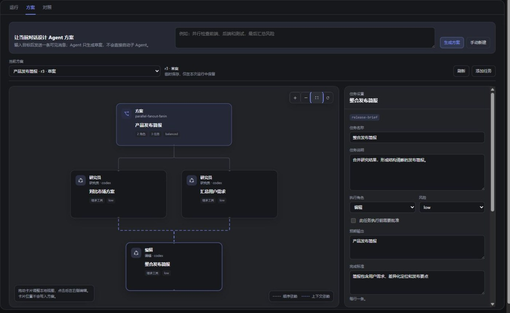
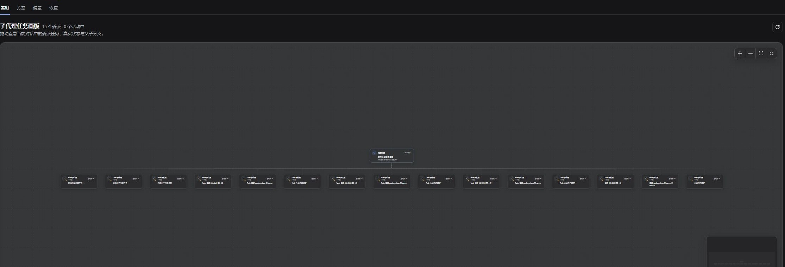
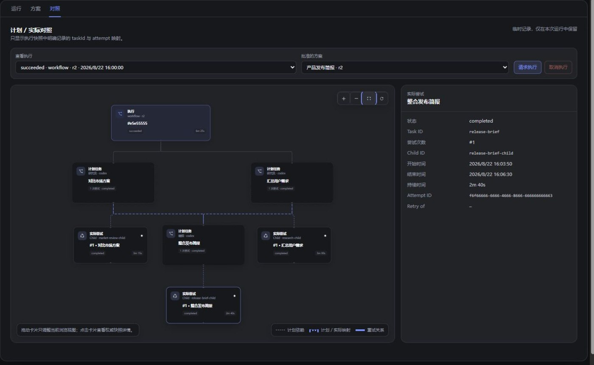
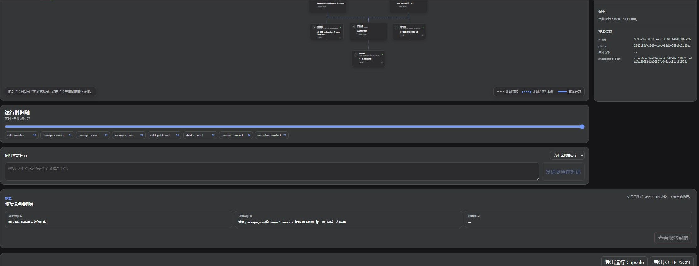

# DSH Product Subagent Console

English · [简体中文](README.zh.md)

[](https://github.com/Jokasa7/dsh-product-subagent-console/actions/workflows/ci.yml)
[](https://github.com/Jokasa7/dsh-product-subagent-console/releases)
[](LICENSE)

From a reviewable plan to evidence-backed recovery — inside one [DeepSeek Harness](https://github.com/deepseek-ai/deepseek-harness) conversation.

This is an independent community plugin, not an official DeepSeek Harness component.

[Install](#install) · [Try it in 60 seconds](#try-it-in-60-seconds) · [Full product tour](docs/product-tour.md) · [Report an issue](https://github.com/Jokasa7/dsh-product-subagent-console/issues)

DSH Product Subagent Console adds a draggable **Subagents** workbench for designing a multi-Agent run, watching the real child tree, checking what actually happened, and preparing a safe next step.

| Mode | What it helps you do |
| --- | --- |
| **Live** | See native child sessions and compatible Provider runs as a real parent-child tree. |
| **Plan** | Turn a goal into editable roles, tasks, dependencies, Providers, tools, checks, and budgets; preflight before approval. |
| **Deviation** | Map approved tasks to actual attempts, replay the event timeline, and find the first evidence-backed mismatch. |
| **Recovery** | Preview what would be retried or reused, ask factual run questions, export a redacted Run Capsule, and derive reusable workflow candidates. |

## See the workflow

| Design and approve the exact task graph | Follow every real child branch |
| --- | --- |
| [](docs/assets/agent-plan-zh.jpg) | [](docs/assets/agent-runtime-zh.jpg) |
| **Plan** — edit roles, dependencies, execution choices, and limits, then preflight the saved revision. | **Live** — inspect actual tasks, lifecycle states, timing, and child relationships on one canvas. |
| Match the plan to what ran | Preview a safe recovery path |
| [](docs/assets/agent-compare-zh.jpg) | [](docs/assets/agent-recovery-zh.jpg) |
| **Deviation** — replay authoritative events and inspect the plan-to-attempt mapping with its evidence summary. | **Recovery** — see affected versus reusable work before producing a Retry or Fork proposal. |

Screenshots use the Simplified Chinese locale; the plugin follows the active DSH language. Open any image for the full-size view.

### Good fits

- Parallel code, documentation, or repository review where ownership and dependencies should stay visible.
- Phased implementation followed by independent verification or synthesis.
- Diagnosing a run that is stuck, incomplete, unexpectedly branched, or missing evidence.
- Turning a repeatedly verified workflow into a reusable starting point without auto-running it.

## Try it in 60 seconds

After enabling the planner tool below, open **Subagents → Plan** and use this read-only example:

> Design a read-only three-Agent workflow. Agent A reads the project positioning from `README.md`; Agent B reads `name` and `version` from `package.json`; Agent C uses only A and B's results to return three facts. Do not modify files. Let me review the plan before execution.

Generate the plan, review its roles and boundaries, run preflight, approve the exact revision, and confirm execution. Then switch between **Live**, **Deviation**, and **Recovery** to see the same run from three practical angles.

The screenshots above come from a real DSH browser session. The v0.9 build was verified with 4 successful read-only workflow runs, 15 observed child sessions, 30 test files / 245 tests, and package/install smoke checks. See the [complete product tour](docs/product-tour.md) for guided scenarios and expected results.

## Install

Download the `.tgz` file and `SHA256SUMS.txt` from the matching [GitHub Release](https://github.com/Jokasa7/dsh-product-subagent-console/releases), verify the archive, and install it into your active profile:

```sh
sha256sum --check SHA256SUMS.txt

# DSH Desktop — run in Open DSH Terminal
dsh plugin add ./dsh-product-subagent-console-0.9.0.tgz

# Regular Web profile
dsh plugin --profile web add ./dsh-product-subagent-console-0.9.0.tgz
```

Restart DSH Desktop or the Web profile after installation.

Plans may contain user-entered objectives, responsibilities, task briefs, completion criteria, and resource names. Do not put credentials or private content in those fields; see [Data and Privacy](docs/data-and-privacy.md).

## Enable planning and execution

Add the planner tool to a copied **Agent Preset**, save it, and start a new conversation with that preset:

```yaml
- id: agent-planner
  name: dsh-product-subagent-console/plan-tool
  config:
    toolName: design_subagent_plan
    executeToolName: execute_subagent_plan
```

Preset changes apply to new conversations. Live observation remains available for ordinary compatible delegation even when the planner tool is not enabled.

## Compatibility

- DeepSeek Harness Web or Desktop profile `0.1.1-rc.2`
- Node.js `^22.19.0` or `>=24.0.0`
- A compatible subagent Provider for planned execution
- The corresponding Provider Bundle for external coding Agents

Keep the plugin and DSH packages on the supported version family shown above.

## Documentation

- [Getting Started](docs/getting-started.md)
- [Complete Product Tour](docs/product-tour.md)
- [Agent Planner](docs/agent-planner.md)
- [Agent Foundry](docs/agent-foundry.md)
- [Data and Privacy](docs/data-and-privacy.md)
- [Troubleshooting](docs/troubleshooting.md)
- [Changelog](CHANGELOG.md)
- [Security](SECURITY.md)

## Uninstall

```sh
dsh plugin remove dsh-product-subagent-console
# or: dsh plugin --profile web remove dsh-product-subagent-console
```

Restart the profile after removal. Existing local Foundry data is not deleted automatically; see [Data and Privacy](docs/data-and-privacy.md#remove-local-foundry-data).

## Support

Use [GitHub Issues](https://github.com/Jokasa7/dsh-product-subagent-console/issues) for reproducible bugs and feature requests. Report vulnerabilities through the private channel in [SECURITY.md](SECURITY.md).

Contributions are welcome; see [CONTRIBUTING.md](.github/CONTRIBUTING.md) for the supported workflow and public-data rules.

## License

[MIT](LICENSE). Third-party notices are listed in [THIRD_PARTY_NOTICES.md](THIRD_PARTY_NOTICES.md).
