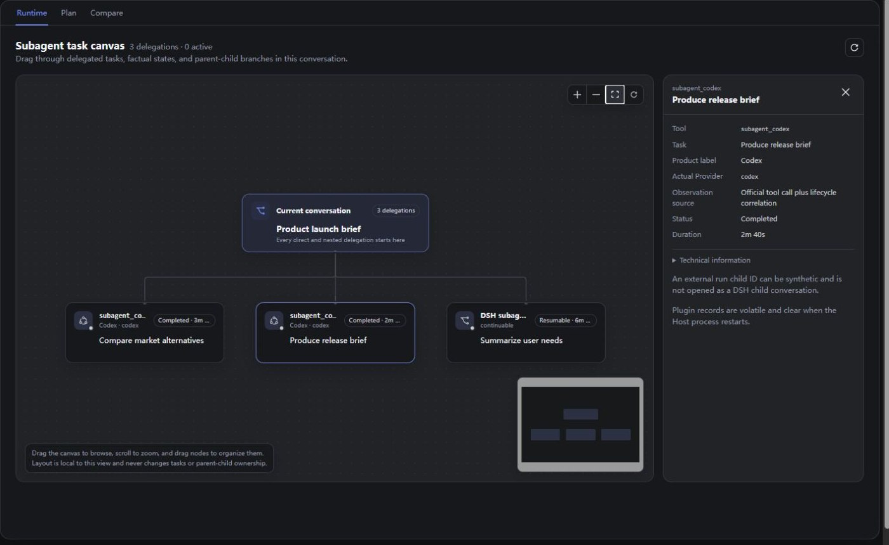
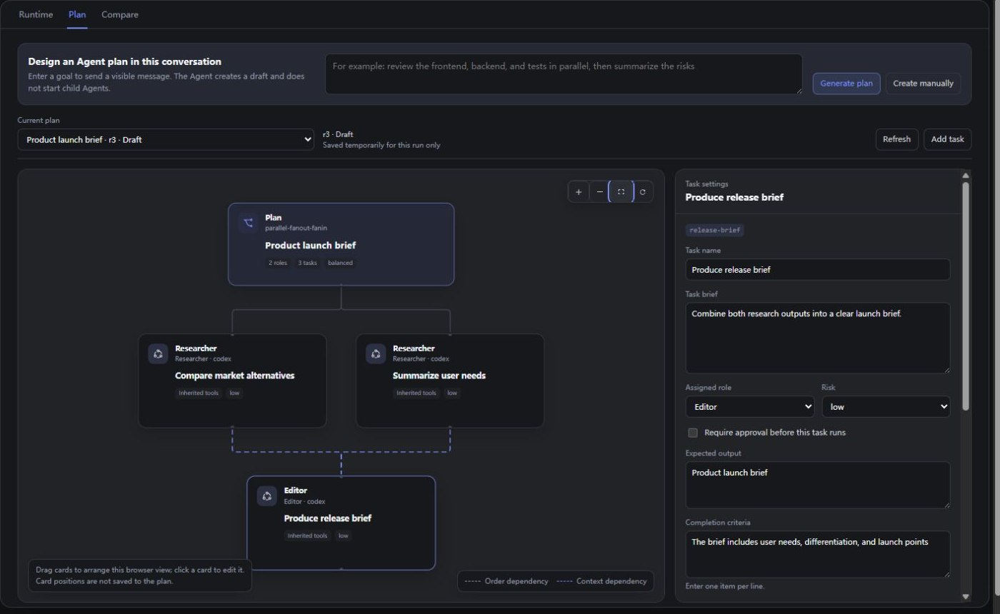
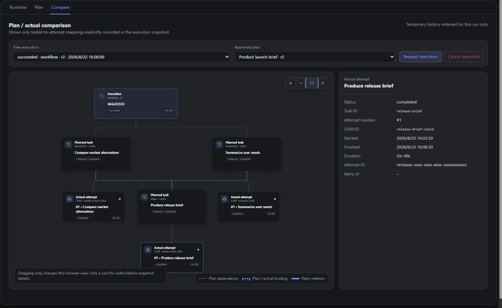

# DSH Product Subagent Console

English · [简体中文](README.zh.md)

[](https://github.com/Jokasa7/dsh-product-subagent-console/actions/workflows/ci.yml)
[](https://github.com/Jokasa7/dsh-product-subagent-console/releases)
[](LICENSE)

See, design, and verify multi-Agent work without leaving a [DeepSeek Harness](https://github.com/deepseek-ai/deepseek-harness) conversation.

The plugin adds a **Subagents** workbench with three connected views: follow delegated work in **Runtime**, prepare an executable plan in **Plan**, and match that plan with the work that actually ran in **Compare**.

> Requires DSH `0.1.1-rc.2`. This is an independent community plugin.
>
> Alpha preview: plans and execution history are cleared when the DSH Web process restarts.

## Three views, one workflow

| View | Use it for | What you can inspect |
| --- | --- | --- |
| **Runtime** | Following current and completed delegation | Parent-child branches, tasks, Providers, state, duration, and native child conversations |
| **Plan** | Designing work before Agents start | Roles, tasks, dependencies, Providers, execution limits, preflight, and approved revisions |
| **Compare** | Verifying planned work against execution | Planned tasks, actual attempts, status, timing, dependencies, and child sessions |

## See it in action

The examples below follow one product-launch brief from delegation through verification.

### Runtime — follow every delegated branch



Runtime places native DSH child sessions and compatible Provider runs on one draggable branch canvas. Pan, zoom, rearrange cards, or select a node to inspect its task, state, duration, and Provider details. Native nodes can also open their child conversation directly.

### Plan — design before execution



Enter a goal to generate a draft, or start manually. Refine roles, responsibilities, tasks, dependencies, Providers, resources, and execution limits before any child Agent starts.

Save the exact revision and run preflight against the capabilities available in the current DSH profile. Resolve blocking issues, review warnings, then approve the revision you want to execute.

### Compare — match the plan with actual work



Compare connects each approved plan task to the attempts and child sessions recorded for that execution. Select a task or attempt to inspect its role, status, timing, dependencies, and expected output. Active executions can also receive a cancellation request.

## From goal to verified execution

1. Open **Subagents → Plan**, enter a goal, and generate or create a draft.
2. Edit the canvas and settings, save the revision, then run preflight.
3. Resolve blocking issues, review warnings, and approve the exact revision.
4. Open **Compare** and request execution. Follow live branches in **Runtime**, then inspect the final plan-to-execution result in **Compare**.

See [Agent Planner](docs/agent-planner.md) for the complete workflow and field guide.

## Install

Download the `.tgz` file and `SHA256SUMS.txt` from the matching [GitHub Release](https://github.com/Jokasa7/dsh-product-subagent-console/releases), verify the archive, then add it to the Web profile:

```sh
sha256sum --check SHA256SUMS.txt
dsh plugin --profile web add ./dsh-product-subagent-console-0.4.0-alpha.2.tgz
dsh --profile web --dump-config
```

Restart the Web profile after installation.

## Enable Agent Planner

Add the planner tool to a copied **Agent Preset**, save it, and create a new conversation with that preset:

```yaml
- id: agent-planner
  name: dsh-product-subagent-console/plan-tool
  config:
    toolName: design_subagent_plan
    executeToolName: execute_subagent_plan
```

Preset changes apply to new conversations only. Regular delegated runs remain visible in **Runtime** even when the planner tool is not enabled.

## Compatibility

- DeepSeek Harness Web profile `0.1.1-rc.2`
- Node.js `^22.19.0` or `>=24.0.0`
- At least one configured compatible subagent Provider for Plan and Compare
- The matching Provider Bundle for each external coding Agent used by a plan or delegated task

Keep the plugin and all DSH packages on the same supported version family.

## Documentation

- [Getting Started](docs/getting-started.md)
- [Agent Planner](docs/agent-planner.md)
- [Troubleshooting](docs/troubleshooting.md)
- [Changelog](CHANGELOG.md)
- [Security](SECURITY.md)

## Uninstall

```sh
dsh plugin --profile web remove dsh-product-subagent-console
```

Restart the Web profile after removal.

## Support

Use [GitHub Issues](https://github.com/Jokasa7/dsh-product-subagent-console/issues) for reproducible bugs and feature requests. Report security issues through the private channel described in [SECURITY.md](SECURITY.md).

## License

[MIT](LICENSE). Third-party notices are listed in [THIRD_PARTY_NOTICES.md](THIRD_PARTY_NOTICES.md).
