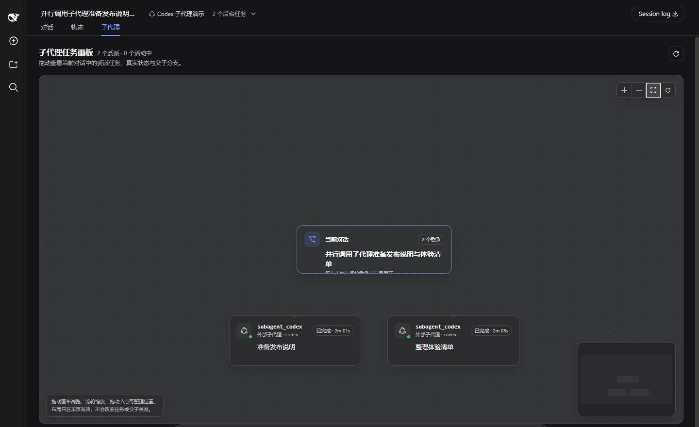

# DSH 产品子代理控制台

[English](README.md) · 简体中文

[](https://github.com/Jokasa7/dsh-product-subagent-console/actions/workflows/ci.yml)
[](https://github.com/Jokasa7/dsh-product-subagent-console/releases)
[](LICENSE)

一个直接嵌入 [DeepSeek Harness](https://github.com/deepseek-ai/deepseek-harness) 对话页面的可拖动子代理任务画布。

> 当前支持 DSH `0.1.1-rc.2`。这是独立社区插件。



## 功能亮点

- 在“对话”和“轨迹”旁新增“子代理”页签。
- 以分支形式展示原生子会话和兼容 Provider 委派。
- 显示每项任务的 Agent、状态和持续时间。
- 支持平移、缩放、小地图、自动排列和节点拖动。
- 点击节点即可查看任务详情。
- 可从详情面板直接打开原生 DSH 子会话。
- 提供英文和简体中文界面。

## 使用要求

- DeepSeek Harness Web Profile `0.1.1-rc.2`
- Node.js `^22.19.0` 或 `>=24.0.0`
- 委派给外部 coding Agent 时，按需安装兼容的 Provider Bundle

插件与全部 DSH 包应保持在同一条受支持的版本线上。

## 安装

1. 从对应的 [GitHub Release](https://github.com/Jokasa7/dsh-product-subagent-console/releases) 下载 `.tgz` 和 `SHA256SUMS.txt`。
2. 校验安装包：

   ```sh
   sha256sum --check SHA256SUMS.txt
   ```

3. 安装到 Web Profile，并确认配置：

   ```sh
   dsh plugin --profile web add ./dsh-product-subagent-console-0.1.0-alpha.2.tgz
   dsh --profile web --dump-config
   ```

4. 重启 Web Profile。

Provider、Agent Preset、更新方法和可选插件工具的完整步骤见[入门指南](docs/getting-started.zh.md)。

## 快速开始

1. 打开**设置 → Agent 预设**，复制一个预设。
2. 为需要使用的 Provider 启用官方委派工具。
3. 使用该预设创建新对话。
4. 发起委派任务，然后打开**子代理**页签。

Preset 变更只对新建对话生效。

## 画布操作

- 拖动画布空白处进行平移，使用鼠标滚轮缩放。
- 拖动卡片可调整它在当前页面中的位置。
- 使用工具栏缩放、适应视图或恢复自动排列。
- 点击卡片查看任务与生命周期详情。

## 使用文档

- [入门指南](docs/getting-started.zh.md)
- [故障排查](docs/troubleshooting.zh.md)
- [更新记录](CHANGELOG.md)
- [安全说明](SECURITY.md)

## 卸载

```sh
dsh plugin --profile web remove dsh-product-subagent-console
```

卸载后请重启 Web Profile。

## 支持

可在 [GitHub Issues](https://github.com/Jokasa7/dsh-product-subagent-console/issues) 提交可复现的问题和功能建议。安全问题请使用 [SECURITY.md](SECURITY.md) 中说明的私密渠道。

## 许可证

[MIT](LICENSE)。第三方许可信息见 [THIRD_PARTY_NOTICES.md](THIRD_PARTY_NOTICES.md)。
