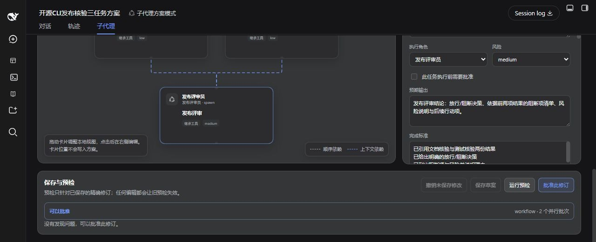
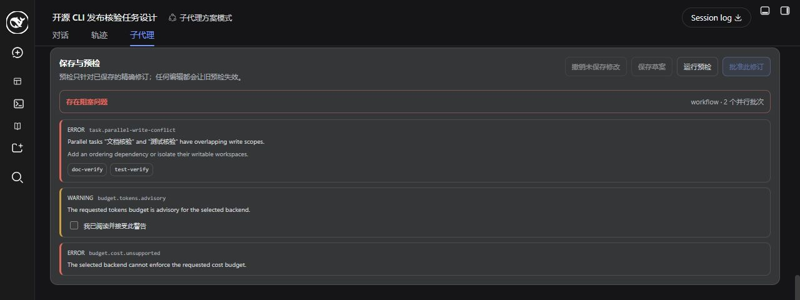
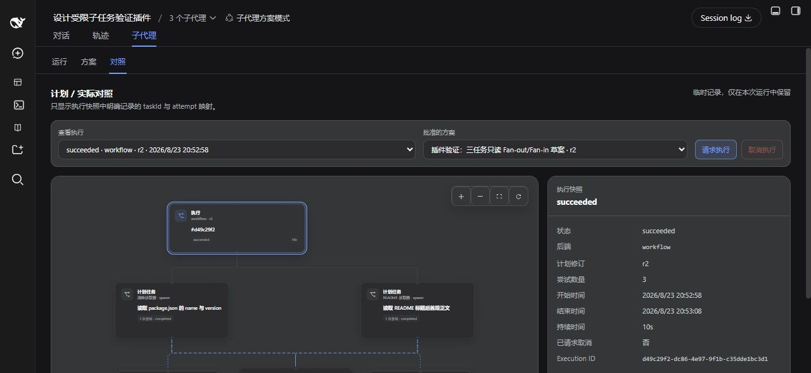
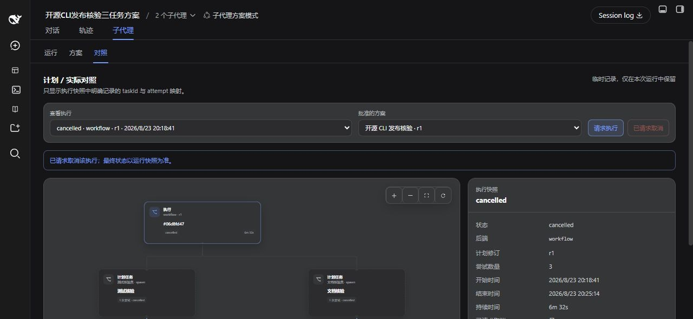

# Complete Product Tour

English · [简体中文](product-tour.zh.md)

These screenshots show the plugin in DSH Desktop as a plan moves from a reviewable draft into real execution. The example runs two read-only tasks in parallel, then passes both results to a downstream summary task.

The latest bounded regression run produced three tasks, two execution batches, three real child conversations, and a final Workflow state of `succeeded` in 10 seconds. Actual time depends on the model, Provider, task scope, and workspace size.

## 1. Edit tasks and dependencies

Select a card in **Plan** to inspect or edit its brief, assigned role, risk, expected output, completion criteria, resource claims, and dependency types. Dashed context edges pass upstream results to the downstream task.

Keep each task bounded: name the files or commands it may use, define the expected output, and include a clear stop condition. This prevents a small check from expanding into unnecessary repository-wide exploration.

## 2. Run preflight before approval

Save the exact revision, then run preflight. A passing result names the backend and execution batches and enables approval for that revision.

Preflight blocks approval when parallel tasks claim overlapping write scopes, a budget cannot be enforced, or the current profile lacks a required capability. Edit the plan, save a new revision, and rerun preflight to continue.

## 3. Follow real delegated work

Once execution begins, **Runtime** shows the current conversation and observed delegation branches. State and duration update as work proceeds. Select a card for details or open a native DSH child conversation.

Pan, zoom, fit the graph, or auto-arrange branches to keep larger runs readable.

## 4. Verify plan versus execution

**Compare** connects tasks from the approved revision to the attempts recorded for that execution. In the bounded example, two upstream tasks complete in parallel and the downstream summary finishes afterward.

Select an execution, planned task, or actual attempt to inspect state, Task ID, attempt number, Child ID, timing, and retry origin.

The regression also opened all three native child conversations and checked their tool traces: the README task read only `README.md`, the package task read only `package.json`, and the synthesis task called no tools. This verifies task boundaries rather than relying on a green final state alone.

## 5. Stop work that is no longer needed

Request cancellation in **Compare** when a task is too broad, exceeds the expected duration, or is no longer needed. DSH remains authoritative for the final state, while the canvas preserves the recorded outcome of both published and not-yet-started tasks.

## Try it yourself

In a new conversation using a preset with the planner tool, enter:

> Design a read-only three-task plan for this workspace. Task A reads only the first paragraph of README.md. Task B reads only the name and version fields from package.json. Run A and B in parallel. Task C uses only those two results to return a three-line summary. Each task must stop immediately after obtaining its requested result. Create the draft only; do not execute it.

Then:

1. Open **Subagents → Plan** and inspect the roles, tasks, and two context dependencies.
2. Save the draft and run preflight.
3. Approve the exact revision.
4. Open **Compare**, select the approved revision, and request execution.
5. Follow branches in **Runtime**, then return to **Compare** to inspect the final mappings.

See [Getting Started](getting-started.md) for installation and preset setup, and [Agent Planner](agent-planner.md) for every field and current execution limit.
