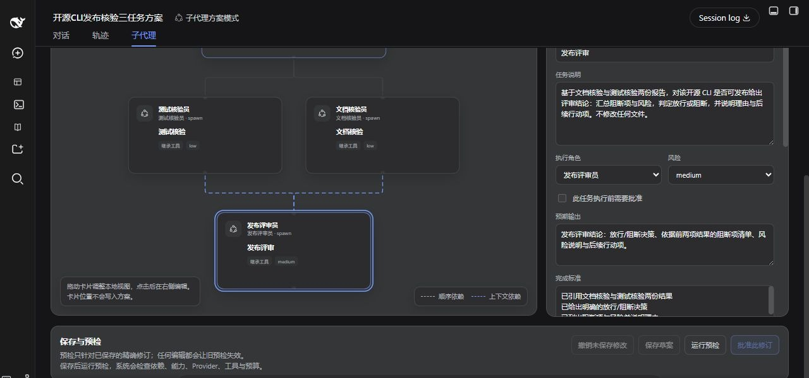
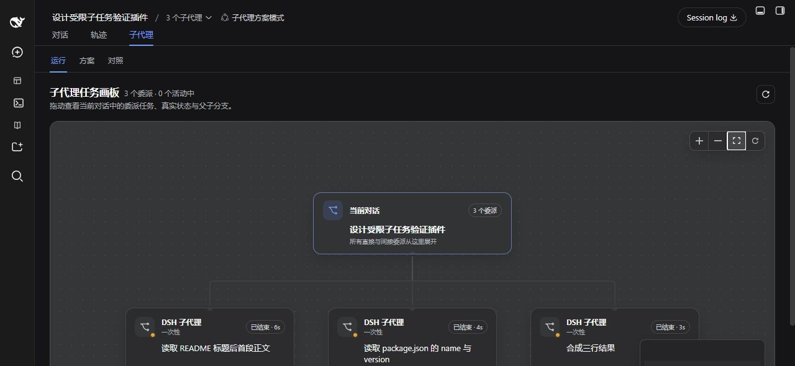

# 完整功能演示

[English](product-tour.md) · 简体中文

这组截图来自 DSH Desktop 中的实际操作，展示一个方案如何从草案进入真实执行。示例将两个只读任务并行运行，再把两份结果传给下游汇总任务。

最新一次受控回归任务的结果是：3 个任务、2 个并行批次、3 个真实子会话，Workflow 在 10 秒内显示 `succeeded`。实际耗时取决于模型、Provider、任务范围和工作区大小。

## 1. 编辑任务与依赖

在**方案**中选择卡片，即可查看和修改任务说明、执行角色、风险、预期输出、完成标准、资源声明与依赖类型。虚线表示上游结果需要传给下游任务。

一个容易被忽略但很重要的做法，是把任务写得足够有边界：指定允许读取的文件或运行的命令、明确输出，并写清楚何时停止。这样能避免简单任务扩展成不必要的全仓库探索。

## 2. 执行前预检

保存精确修订后运行预检。通过时会显示后端、并行批次数以及“可以批准”，此时才能批准该修订。

如果并行任务声明了重叠的写入资源、预算无法被后端强制执行，或当前 Profile 缺少所需能力，预检会阻止批准。修改方案并重新保存、预检即可继续。

## 3. 观察真实子代理

执行开始后，**运行**会显示当前对话与真实委派分支。状态和耗时会持续更新；选择卡片可以查看任务详情，也可以打开 DSH 原生子会话。

画布支持平移、缩放、适应视图和自动排列。节点位置只影响当前浏览视图，适合在分支较多时整理阅读顺序。

## 4. 核验计划与实际执行

**对照**把批准修订中的计划任务与本次执行创建的 attempts 连接起来。下面的受控示例中，两个上游任务并行完成，汇总任务随后完成，整个 Workflow 用时 10 秒。

选择执行、计划任务或实际尝试，可以查看状态、Task ID、尝试次数、Child ID、开始与结束时间以及重试来源。

这次回归还逐个打开了三个原生子会话核对工具轨迹：README 任务只读取 `README.md`，包信息任务只读取 `package.json`，汇总任务没有调用工具。这样能验证的不只是“最终变绿”，还包括每个 Agent 是否真的遵守了分工。

## 5. 停止不再需要的执行

当任务范围过宽、运行时间超出预期或用户不再需要结果时，可以在**对照**中请求取消。最终状态以 DSH 执行快照为准；未启动的下游任务和已经发布的子任务都会如实显示各自结果。

## 自己体验一次

在启用了方案工具的新对话中输入：

> 请为当前工作区设计一个只读的三任务方案：任务 A 只读取 README.md 第一段，任务 B 只读取 package.json 的 name 和 version，两者并行；任务 C 只基于两者结果输出三行汇总。每个任务得到目标结果后立即停止。只生成草案，不要执行。

然后依次完成：

1. 打开**子代理 → 方案**，检查角色、任务和两条上下文依赖；
2. 保存草案并运行预检；
3. 批准精确修订；
4. 打开**对照**，选择批准的修订并请求执行；
5. 在**运行**观察分支，再回到**对照**确认最终映射。

安装与预设配置见[入门指南](getting-started.zh.md)，全部字段与限制见[Agent 方案设计器](agent-planner.zh.md)。
